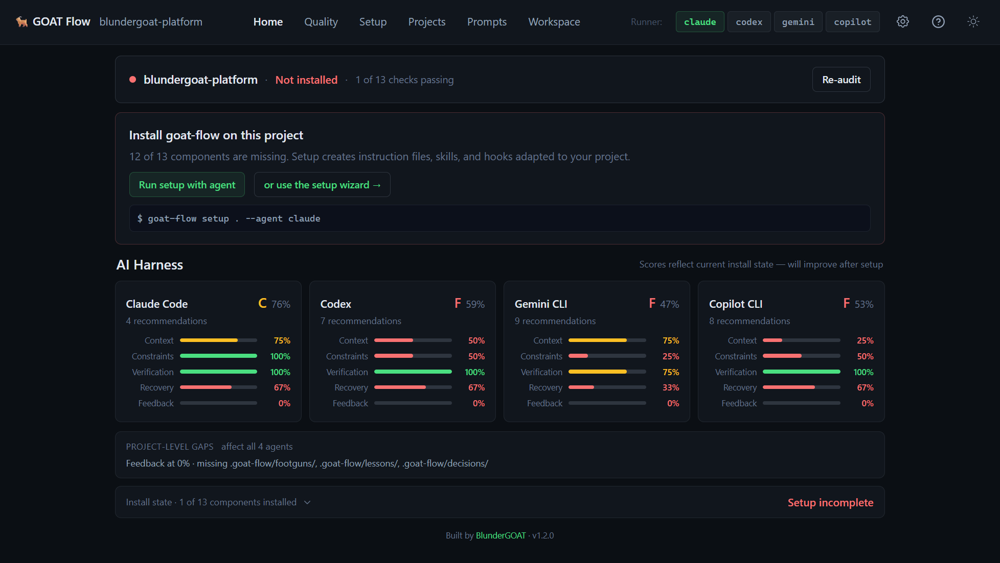

# GOAT Flow

A structured workflow system for AI coding agents. Gives Claude Code, Gemini CLI, and Codex an execution loop, autonomy tiers, enforcement hooks, and a learning loop — instead of a wall of rules they half-follow.

## Quick Start

```bash
npm install --save-dev @blundergoat/goat-flow
npx goat-flow dashboard
```

Open the dashboard, click **Scan**, see your score. Click **Setup** to generate setup instructions, then paste them into your coding agent.



## Install Options

**Recommended (project-level):**

```bash
# npm
npm install --save-dev @blundergoat/goat-flow

# pnpm (extra step for terminal feature)
pnpm add -D @blundergoat/goat-flow
pnpm approve-builds    # select node-pty when prompted

# yarn
yarn add -D @blundergoat/goat-flow
```

**Global (optional):**

```bash
npm install -g @blundergoat/goat-flow
goat-flow dashboard    # works without npx
```

**Try without installing (scan only — no terminal):**

```bash
npx @blundergoat/goat-flow scan .
```

## Commands

```bash
npx goat-flow dashboard                   # Visual dashboard with scanner + terminal
npx goat-flow scan                        # CLI scanner (text output)
npx goat-flow setup --agent claude        # Generate setup prompt for Claude Code
npx goat-flow setup --agent codex         # Generate setup prompt for Codex
npx goat-flow setup --agent gemini        # Generate setup prompt for Gemini CLI
npx goat-flow scan --min-score 75         # CI gate (exit 1 if below)
npx goat-flow scan --format json          # Machine-readable output
```

## What It Does

**Execution loop:** READ → CLASSIFY → SCOPE → ACT → VERIFY → LOG. Prevents fabrication (READ), scope creep (SCOPE), and broken code (VERIFY).

**Enforcement hooks:** Pre-tool hooks block dangerous commands (100% block rate vs ~70% for rules alone). Post-turn hooks lint after every change.

**5 skills + dispatcher:** `/goat` routes to `/goat-debug`, `/goat-review`, `/goat-plan`, `/goat-test`, or `/goat-security`. Each has structured phases with human gates.

**Learning loop:** `docs/footguns/` captures architectural traps with file:line evidence. `ai/lessons/` captures real incidents. Agent evals replay past failures.

**Scanner:** Scores your project across 91 checks + 18 anti-patterns. The dashboard shows what's missing and how to fix it.

## Skills

```
/goat fix the login bug           → /goat-debug (diagnose)
/goat review the PR               → /goat-review
/goat plan the new feature        → /goat-plan
/goat check for security issues   → /goat-security
/goat how does the auth work      → /goat-debug (investigate)
/goat generate a test plan        → /goat-test
```

All 5 skills are also directly invocable: `/goat-debug`, `/goat-review`, etc.

## Multi-Agent Support

| | Claude Code | Gemini CLI | Codex |
|---|---|---|---|
| Instruction file | CLAUDE.md | GEMINI.md | AGENTS.md |
| Skills | .claude/skills/ | .github/skills/ | .agents/skills/ |
| Hooks | .claude/hooks/ | .gemini/hooks/ | .codex/hooks/ |

All agents share the same execution loop, autonomy tiers, and learning loop.

## Troubleshooting

**Terminal not showing in dashboard?**
node-pty didn't compile. Fix: `npm install node-pty` or `pnpm approve-builds` (select node-pty).

**pnpm: node-pty not building?**
pnpm blocks native builds by default. Run `pnpm approve-builds` and select node-pty, then restart the dashboard.

**Scan shows 0% on a fresh project?**
Expected. Run `npx goat-flow setup --agent claude` to generate setup instructions, then paste into your agent.

**npx: command not found?**
Install Node.js 18+.

## Documentation

| Document | What it covers |
|----------|---------------|
| [Getting Started](docs/getting-started.md) | Reading order, setup checklist |
| [System Spec](docs/system-spec.md) | Full technical specification |
| [5-Layer Architecture](docs/system/five-layers.md) | Runtime, Skills, Evaluation layers |
| [Skills Reference](docs/system/skills.md) | All skills: when to use, gates, outputs |

## Author

Built by [Matthew Hansen](https://www.blundergoat.com/about).

## License

[MIT](LICENSE)
