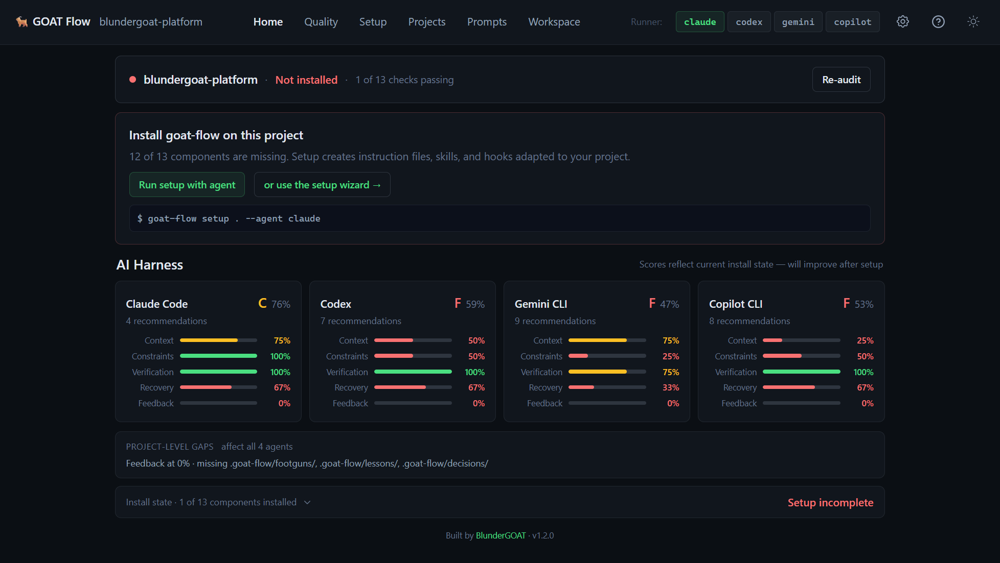

# GOAT Flow

**An AI coding agent harness and local dashboard for Claude Code, OpenAI Codex, Google Antigravity, and GitHub Copilot.**

GOAT Flow audits agent setup, installs guardrails and deny hooks, provides structured `/goat-*` workflows, and preserves lessons between sessions. Its manifest-backed registry keeps the same harness available across all four supported coding agents.

[](https://www.npmjs.com/package/@blundergoat/goat-flow) [](LICENSE)

```bash
npx @blundergoat/goat-flow@latest
```

Output:

```text
What do you want to do?
  1. Start dashboard
  2. Install/update goat-flow files
  3. Generate setup prompt
  4. Audit current project
  5. Show project status
```

Install locally when you want a project-pinned version:

```bash
npm install --save-dev @blundergoat/goat-flow
```

Then launch the dashboard through npm:

```bash
npm exec --package=@blundergoat/goat-flow -- goat-flow dashboard .
```

The embedded terminal needs the optional `node-pty` package to compile. See [Troubleshooting](#troubleshooting) if the terminal does not appear.

<<<<<<< Updated upstream
## What GOAT Flow adds
=======
## Dashboard views



The desktop dashboard uses a persistent side menu for primary navigation. The
header keeps the current project switcher, runner switcher, and utility actions
available while you move between views.

### Home

Live audit results for every supported agent. Per-agent cards show pass/fail across two scopes (GOAT Flow Setup, Agent Setup) with actionable fix hints. An AI Harness section scores each agent across five concerns - Context, Constraints, Verification, Recovery, and Feedback Loop - so you can see exactly where your setup is strong and where it's weak. "What to do next" action cards surface the highest-priority gaps. Re-audit after changes without leaving the page.

### Plans

Plan milestone view for the selected project. Surfaces `.goat-flow/plans/` plan
directories, milestone status, and checkbox progress, and lets you set the
active plan.

### Setup

Guided setup flow. Detects your project stack and existing configuration, lets you pick a target agent, then generates a setup prompt you can preview and launch directly in a terminal session. The agent configures your project: instruction file, skills, hooks, and learning loop.

### Prompts

A library of 24 visible preset prompts across six categories: critique, debug, plan, QA, review, and security, plus 2 internal quality prompts used by dashboard workflows. Two-pane layout with search, category filters, and favorites. Select a prompt and launch it in a new terminal, send it to an active session, or copy it to clipboard. Keyboard-navigable: `/` to search, arrows to browse, Enter to launch.

Prompts include structured workflows like pre-walk-through notes with targeted testing plans, multi-lens critiques, full threat assessments, dependency scans, coverage audits, and milestone planning.

### Workspace

Split layout for terminal work. A sessions rail lists all running terminal sessions (up to 10) with runner, age, and idle indicators, plus collapsed-rail tooltips and an active-session status pip. Single-click switching between sessions. The right pane is a full xterm.js terminal with WebSocket-based PTY - run Claude, Codex, Antigravity, or Copilot directly in the browser. Drag and drop images onto the terminal pane to attach them to the next prompt.

### Projects

Multi-project browser. The Projects view discovers immediate non-hidden folders beside the launch project and lets you register paths elsewhere. `Refresh Status` updates lightweight setup/version state without writing identity markers; `Open audit` switches to Home for the full report. Archive hides a project while retaining its checkout-local dashboard identity, title, and aliases for Restore. Titles and favorites follow a stable identity where possible: git remote hash first, then a local `.goat-flow/project-id` marker for explicitly registered non-git goat-flow projects, then path fallback.

### Quality

Generate agent quality-assessment prompts. Select a target agent, generate the
prompt, and preview the full output with embedded audit results. Passive page
loads use cached audit enrichment when available so the view opens quickly;
Regenerate requests a fresh audit before composing the prompt.

## What's under the hood

The dashboard is the interface. Underneath, GOAT Flow installs a harness that makes agents more reliable:
>>>>>>> Stashed changes

| Component | What it prevents |
|---|---|
| **Execution loop** (READ → SCOPE → ACT → VERIFY) | Guessing at unread code or shipping without checks |
| **Eight skills** (seven `/goat-*` workflows, including direct `/goat-clarity`, plus dispatcher) | Free-form prompting that drifts mid-task |
| **Enforcement hooks** | Destructive commands, repository publication, and direct secret-path access |
| **Learning loop** | The same mistake recurring in later sessions |
| **Autonomy tiers** | Agent overreach and missed approval boundaries |

Skills provide explicit phases and human gates. Hooks reject covered tool calls before they execute. The learning loop turns verified failures into durable lessons, footguns, and decisions.

## Dashboard


The local dashboard keeps project and runner selection available while you move between operational views:

| View | Use it for |
|---|---|
| **Home** | Compare setup and harness results across supported agents, then follow the highest-priority repair |
| **Setup** | Detect the project, install deterministic files, and generate project-specific setup prompts |
| **Prompts** | Search 24 visible presets across critique, debug, plan, QA, review, and security |
| **Workspace** | Run up to 10 PTY-backed terminal sessions and attach images to prompts |
| **Plans** | Inspect local milestones, checkbox progress, and the active-plan pointer |
| **Projects** | Register projects, compare audit status, and switch the dashboard target |
| **Skills** | Audit installed skills or evaluate draft Markdown without installing it |
| **Quality** | Generate source-aware assessment prompts and compare saved reports |
| **Hooks** | Inspect and toggle shipped guardrail, quality, and safety hooks |

Settings and About provide local preferences and orientation. See the [Dashboard reference](docs/dashboard.md) for view details, security boundaries, and API endpoints.

## Why an instruction file is not enough

Instruction files tell the agent what to do. They don't enforce it.

|  | Instruction file alone | GOAT Flow |
|---|---|---|
| Tell the agent the rules | yes | yes |
| Block dangerous commands at tool level | no | yes |
| Structured workflows with human gates | no | yes |
| Capture lessons across sessions | no | yes |
| Audit whether setup is actually correct | no | yes |

Use an instruction file for rules the agent should remember. Use GOAT Flow when a rule also needs structural enforcement, verification, or recovery.

## Getting started

Requires Node.js 20.11+.

### 1. Start with the menu

```bash
npx @blundergoat/goat-flow@latest
```

No install required. Choose dashboard, deterministic install/update, setup prompt generation, audit, or status from the menu.

### 2. Install/update system files

For a brand new project, copy the goat-flow system files first. This step is deterministic and does not require an agent:

```bash
npx @blundergoat/goat-flow@latest install . --agent claude
npx @blundergoat/goat-flow@latest install . --agent claude --dry-run
```

`--dry-run` shows managed-template drift without writing. A normal install refreshes system-owned files, preserves user-owned and external files, and blocks ambiguous local edits or unsafe paths. `--force` accepts managed conflicts and may replace seeded user-owned guidance, but it never bypasses path-safety failures. Replacements are atomic per file; the [CLI reference](docs/cli.md#atomic-installer-writes) explains failure and rollback behaviour.

Dashboard Home and aggregate `goat-flow audit .` read supported agents from `workflow/manifest.json`. Use `--agent <id>` when you intentionally want one runtime. Installs also include shared meta references and on-demand tool playbooks under `.goat-flow/skill-docs/`.

### 3. Generate the setup prompt

The installer copies shared system files. The setup prompt still creates or refreshes project-specific content such as the instruction file, architecture, code map, and real project footguns/lessons.

```bash
npx @blundergoat/goat-flow@latest setup . --agent claude
```

Equivalent deterministic setup/update command:

```bash
npx @blundergoat/goat-flow@latest setup . --agent claude --apply
```

### 4. Re-audit

Back on the Home view, click **Re-audit**. Each failure names the missing or stale surface and provides a repair hint. Harness cards show structural coverage across the five concerns.

### 5. Use a prompt

Open the **Prompts** view, pick a workflow (code review, bug diagnosis, UI debugging with browser evidence, security assessment, test planning), and launch it in a terminal session. Each prompt invokes a structured `/goat-*` skill with phases and human gates.

## Multi-agent support

GOAT Flow's manifest-backed registry supports **Claude Code, Codex, Google Antigravity, and Copilot CLI**. Their installed templates share the execution loop, autonomy tiers, skills, and learning loop. The dashboard runner switcher shows their audit results side by side.

Run `npx @blundergoat/goat-flow@latest manifest` to inspect the live agent matrix from `workflow/manifest.json`.

## CLI commands

The dashboard covers most workflows visually. For CI or scripting, the same features are available as CLI commands:

```bash
npx @blundergoat/goat-flow@latest dashboard .                  # Launch the dashboard
npx @blundergoat/goat-flow@latest audit .                      # Run audit (pass/fail output)
npx @blundergoat/goat-flow@latest audit . --harness            # Add AI harness scoring
npx @blundergoat/goat-flow@latest audit . --format json        # JSON output for CI
npx @blundergoat/goat-flow@latest audit . --format sarif       # SARIF output for code scanning upload
npx @blundergoat/goat-flow@latest install . --agent claude     # Copy/update system files
npx @blundergoat/goat-flow@latest setup . --agent claude       # Generate setup prompt
npx @blundergoat/goat-flow@latest quality . --agent claude     # Generate quality-assessment prompt
npx @blundergoat/goat-flow@latest redact --output .goat-flow/logs/sessions/handoff.md
npx @blundergoat/goat-flow@latest plans export .goat-flow/plans/<version> --format markdown
npx @blundergoat/goat-flow@latest status .                     # Project state (bare/partial/v0.9/outdated/current/error)
npx @blundergoat/goat-flow@latest manifest                     # Agent support matrix
```

Audit-backed CLI commands inspect checkout hook configuration statically by default. Add `--trusted-target` to a selected-agent audit, setup prompt, quality prompt, or `hooks verify` only after confirming that the checkout's configured hook launcher and managed scripts are safe to execute. The dashboard never runs target hook code.

Use `redact` before saving a session, handoff, review, quality, security, or export draft. It replaces common credential shapes while preserving useful continuation context; it is not perfect DLP or a substitute for reviewing the output.

For interrupted work without an active milestone, `.goat-flow/logs/sessions/README.md` provides the optional handoff receipt schema. Run the command, paste the receipt into stdin, and send EOF so raw text is scrubbed before the output file is created.

The dashboard prints a tokenized localhost URL. Open that URL from the terminal output; the token is process-local and is removed from the visible address bar after the page boots.

See [docs/cli.md](docs/cli.md) for the full reference.

## The five harness concerns

GOAT Flow groups its harness checks into five concerns:

| Concern | Question |
|---------|----------|
| **Context** | Is the agent's context accurate, lean, and useful? |
| **Constraints** | Do deterministic rules catch failures before the LLM runs? |
| **Verification** | Can the agent verify its work, and does failure feed back? |
| **Recovery** | Can the agent resume after crash or interruption? |
| **Feedback Loop** | Is the harness getting smarter from failures over time? |

See [Harness engineering](docs/harness-engineering.md) for the model and [Audit & Quality](docs/audit-and-quality.md) for the evaluation workflow.

## Troubleshooting

**Terminal not showing in dashboard?**
goat-flow installs without a C++ toolchain as of v1.2.4. If you need the dashboard's embedded terminal, you'll also need `node-pty` to compile. Install build tools (`sudo apt install build-essential python3` on Debian/Ubuntu, `xcode-select --install` on macOS), then run `npm rebuild node-pty`. To skip the native build entirely: `npm install @blundergoat/goat-flow --omit=optional`.

**Audit fails on a fresh project?**
Expected. Run `npx @blundergoat/goat-flow@latest install . --agent claude`, then generate the setup prompt with `npx @blundergoat/goat-flow@latest setup . --agent claude`.

**Audit still fails after setup?**
Re-run `npx @blundergoat/goat-flow@latest audit . --verbose` to see which check failed. The `howToFix` hint on each failure points at the missing file or config key.

**Agent isn't following the execution loop?**
Restart the agent session after setup so it re-reads the instruction file. Agents only pick up instruction-file changes on session start.

**Setup prompt looks wrong or incomplete?**
Regenerate from the dashboard Setup page, which shows detected stack info alongside the prompt.

## Documentation

| Document | What it covers |
|---|---|
| [CLI Reference](docs/cli.md) | All commands, flags, and output formats |
| [Dashboard](docs/dashboard.md) | Views, local access boundary, terminal, and API endpoints |
| [Audit & Quality](docs/audit-and-quality.md) | Deterministic audit versus agent-driven quality assessment |
| [Deterministic Audit Checks](docs/audit-checks.md) | Stable check IDs, scopes, and command matrix |
| [Harness Engineering](docs/harness-engineering.md) | The five-concern model and its sources |
| [Harness Audit](docs/harness-audit.md) | Harness scoring, evidence limits, and check semantics |
| [Skills](docs/skills.md) | All eight skills, their modes, gates, and outputs |
| [Skill Authoring](docs/skill-authoring.md) | Candidacy, RED evidence, scaffolding, and draft validation |
| [Guardrails](docs/guardrails.md) | Runtime command-safety surfaces and limitations |
| [Coding Standards](docs/coding-standards/conventions.md) | Repository architecture, commands, and implementation conventions |

## Author

Built by [Matthew Hansen](https://www.blundergoat.com/about).

## License

[MIT](LICENSE)
