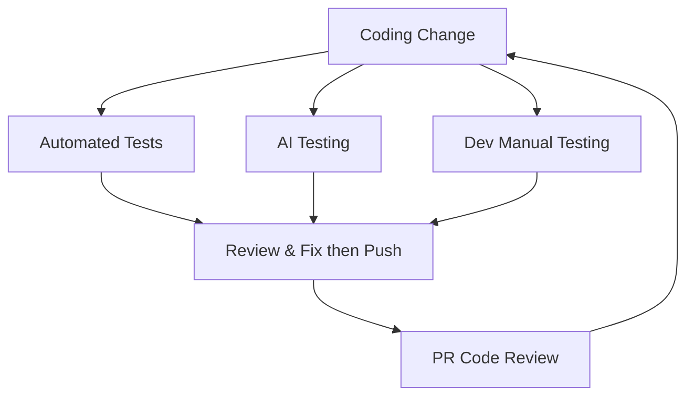

# Testing Workflow - Doer Verifier Pattern

> Every milestone (or 30-60 min run) must pass all testing before starting the next one. If testing or code review discovered errors or regressions, then get coding agent to fix then re-enter the doer-verifier loop.

---

## End of Milestone Testing (or after 30-60 min run)

Run all three tracks in parallel. Start them at the same time.

### Track 1 - Automated Tests (terminal 1)

1. `preflight-checks.sh`
2. `run-e2e-tests.sh` → option 1 (quick, ~6 mins)
3. Run full batch of demo scenarios (or random 10)
4. Once batch of demo scenarios complete, give export json to coding agent in review and fix phase

### Track 2 - AI Testing (terminal 2 + browser)

1. Open Claude browser plugin and prompt: *"Can you manually test this system, but don't run any of the demo scenarios. I want this to be more like a natural receptionist system."*
2. In a separate terminal, open a fresh instance of copilot cli and prompt: *"Deeply review the code changes and look for blockers or anything important that should be changed before merging. Don't make any code or file changes."*

### Track 3 - Dev Manual Testing (you)

1. Ask the coding agent for manual testing instructions for all code changes
2. Manually test each item and note down anything that is not acceptable

---

## Review and Fix

Once all three tracks are done:

1. Collect findings from all tracks and feed back to the coding agent
2. If fixes are needed, ask the coding agent to create a temporary `TODO_fixes.md` with a plan to fix and stabilise changes before committing or merging
3. Read and review the plan, then ask:
   - *"Which models are best to work on this?"*
   - *"Can we split this into milestones based on splitting tasks to different model levels?"*
   - *"Update the plan so it can be worked on with sub agents in parallel."*
4. Execute the fix plan, then re-run all three tracks

---

## Code Review (after push, before merge)

1. Run copilot PR review
2. Copy the entire review and give to the coding agent: *"Here is a PR code review from copilot, do you agree with anything?"*
3. While waiting, review the copilot PR review comments yourself
4. If changes needed, loop back through the three tracks

---

## Coding Agent Cadence

- ~30 mins of coding agent work, then ~30 mins of parallel testing across all three tracks
- The coding agent should never run longer than dev manual testing - if you're not testing, the agent shouldn't be coding
- Don't let the coding agent run unsupervised for extended periods
- Always use a fresh agent (copilot cli or separate claude code instance) to verify milestone completion - don't trust the coding agent's self-assessment
- Make sure completed tasks are ticked off in the plan

---

## Milestone Gate

A milestone is complete when:

- [ ] All plan tasks are ticked off (verified by a fresh agent, not the coding agent)
- [ ] All three testing tracks passed
- [ ] Fix cycle completed (if applicable)
- [ ] Results recorded in the GitHub issue
