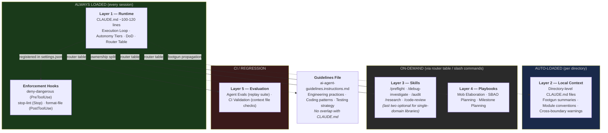
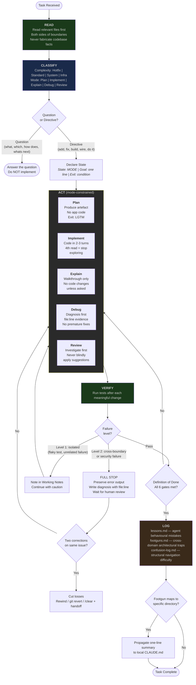

# AI Workflow Design Rationale — Prime Edition

**Companion to:** `ai-workflow-improvement-plan-prime.md` (v1.5)
**Purpose:** Per-section "problem it solves" context and source attributions for every design decision in the plan.

---

## Sources Referenced

| Short Name          | Full Reference                                                                                   |
| ------------------- | ------------------------------------------------------------------------------------------------ |
| HumanLayer          | HumanLayer's CLAUDE.md research — instruction budgets, auto-generated context performance impact |
| Philipp Schmid      | Philipp Schmid — frontier model instruction following limits (~150-200 effective instructions)   |
| GitHub 2,500-repo   | GitHub's 2,500-repo agents.md analysis — tool mention effect (160x usage uplift)                 |
| awslabs/aidlc       | awslabs/aidlc-workflows — structured agent lifecycle patterns                                    |
| Oruç                | Ömer Faruk Oruç's claude.md — execution loop and mode classification patterns                    |
| Trail of Bits       | Trail of Bits claude-code-config — deny-dangerous patterns, security hardening                   |
| Boris Tane          | Boris Tane's Claude Code workflow — session management, handoff protocols                        |
| Microsoft AutoDev   | Microsoft AutoDev paper — autonomous agent guardrails and verification loops                     |
| Propel              | Propel's codebase structuring guide — context loading strategies                                 |
| BlunderGOAT SBAO    | BlunderGOAT — SBAO planning methodology                                                          |
| BlunderGOAT Scanner | BlunderGOAT — SEO Scanner case study (PHP library implementation)                                |
| BlunderGOAT CC      | BlunderGOAT — Claude Code Insights article                                                       |
| BlunderGOAT PBYP    | BlunderGOAT — Plan Before You Prompt article                                                     |

---

## High-Level: System Architecture

---

## Low-Level: Execution Loop

---

## System Architecture (5 Layers)

**Problem it solves:** Loading all instructions every session wastes context budget and degrades compliance. Projects accumulate rules, playbooks, skills, and docs — if everything loads at once, the model gets worse at following _all_ of it.

**Key evidence:**

- Auto-generated context files reduce success rates by ~3% while increasing inference cost by 20%+ (HumanLayer)
- Frontier models follow ~150-200 instructions reliably; Claude Code's system prompt consumes ~50, leaving ~100-150 for CLAUDE.md (Philipp Schmid, HumanLayer)
- Tools mentioned in AGENTS.md are used 160x more often than unmentioned ones — the router table is the highest-signal section (GitHub 2,500-repo)

**Design decision:** Only Layer 1 (CLAUDE.md, ~100-120 lines) loads every session. Everything else loads on demand via the router table, slash commands, or automatic directory-level loading. This keeps the always-loaded budget small while making everything else discoverable.

**Why 5 layers, not 3 or 7:** Each layer has a distinct loading trigger — always (L1), automatic per-directory (L2), on-demand by user (L3/L4), or CI/regression (L5). Fewer layers would combine different loading semantics. More would create layers with no meaningful distinction.

---

## Guidelines Ownership Split

**Problem it solves:** Projects with both CLAUDE.md and a shared guidelines file (e.g., `ai-agent-guidelines.instructions.md`) end up with overlapping rules — two different Definitions of Done, two different testing strategies. The agent follows whichever it reads last, creating inconsistent behaviour.

**Source:** Direct experience on a Tauri app where CLAUDE.md had a DoD ("tests green, preflight passes, logs updated") and the guidelines file had a different DoD ("tests pass, rollback strategy exists, verification story"). The agent alternated between them unpredictably.

**Design decision:** Clean ownership boundary. CLAUDE.md owns workflow (execution loop, autonomy tiers, DoD, logs, router). Guidelines owns engineering practices (coding patterns, communication style, testing strategy, error handling). Test: if a rule would be identical across every project, it belongs in guidelines. If it changes per project, it belongs in CLAUDE.md.

**Evidence it works:** Applying the split to a PHP library shrunk the guidelines file from 47 to 39 lines — the DoD section ("Before Marking Done") was the overlap. What survived was the right shape for a shared file.

**Committed overlap report:** Both Claude Code and Codex implementations independently produced a `docs/guidelines-ownership-split.md` documenting what was removed and why. This pattern is now a recommended standard output — it preserves migration rationale in a committed file rather than losing it when the chat session ends.

---

## Layer 2: Local CLAUDE.md Files

**Problem it solves:** `docs/footguns.md` is a central index the agent must explicitly load. If it doesn't load the file, it doesn't see the warnings. A local CLAUDE.md at `src/auth/CLAUDE.md` is read automatically whenever Claude works in that directory — no explicit loading required.

**Source:** Claude Code's automatic CLAUDE.md loading behaviour (reads CLAUDE.md in the working directory plus all ancestor directories up to the project root).

**Design decision:** Footgun entries that map to a specific directory are propagated (not moved) as one-line summaries to that directory's local CLAUDE.md. The central footguns.md remains the source of truth; local files are read-time copies for automatic loading. Put the guardrail where the danger is, not in a file the agent might skip.

**Guard against over-creation:** Only create local files when a directory has 2+ footgun entries, is an Ask First boundary, or has conventions differing from the project default. Most directories don't qualify. A flat-structure library rarely needs any.

**Instruction files as substitute:** `.github/instructions/` files with `applyTo` frontmatter serve the same auto-loading purpose as local CLAUDE.md files. If a directory already has a scoped instruction file, a local CLAUDE.md may be redundant. On the shell script collection, `lib/stacks/` had 3 footguns but was rejected for a local CLAUDE.md because `stacks.instructions.md` already covered it. Only `lib/ai-cli/` — the one domain without instruction file coverage — got a local CLAUDE.md.

---

## Project Shape: App vs Library vs Collection

**Problem it solves:** A one-size-fits-all plan wastes instruction budget on irrelevant content. A PHP library doesn't need `/research` (single-domain, the READ step suffices), permission profiles (single language), or `confusion-log.md` (single-domain confusion is rare). An app with 14 footguns across TypeScript and Rust needs all of these. A multi-domain script collection sits between the two.

**Source:** Cross-referencing four real implementations — a Tauri app (121-line CLAUDE.md, 6 skills, 14 footguns), a PHP library (99-line CLAUDE.md, 3 skills, 6 footguns), a medical scribe (118-line CLAUDE.md, 5 skills, 8 footguns), and a shell script collection (96-line CLAUDE.md, 4 skills, 8 pre-existing footguns). Same plan, same prompts, meaningfully different outputs. The shell script collection exposed that the app/library binary was insufficient — a multi-domain collection with cross-domain coupling needs app-level Ask First boundaries but library-level line targets. (BlunderGOAT Scanner, BlunderGOAT CC)

**Design decision:** Every section in the plan that differs by project shape includes explicit app/library/collection guidance. The three-column adaptation table in the plan makes this visible in one place. Projects that don't fit cleanly into a single column should read all columns and pick the stricter guidance for each row.

---

## Skill Justification Test

**Problem it solves:** Skill proliferation. Early versions of the plan had 8+ skills. Each skill consumes instruction budget when loaded and creates maintenance burden. Most didn't earn their place — they were templates, not workflows.

**Source:** Direct experience. Four skills were downgraded during the v0.8 revision after failing the justification test.

**Design decision:** A skill must have at least one of: a distinct artefact, a hard workflow gate, a special failure mode, or a repeatable structured output. The plan documents which skills passed and which were downgraded to sections within other files. This prevents future skill sprawl.

| Former Skill        | Why it failed                                          | Where it went                       |
| ------------------- | ------------------------------------------------------ | ----------------------------------- |
| `/annotation-cycle` | No distinct artefact — it's a planning refinement step | Section in mob elaboration playbook |
| `/sbao-synthesis`   | Template, not a workflow with gates                    | Section in SBAO planning playbook   |
| `/review-triage`    | Normal review behaviour, not a distinct mode           | Review branch of the ACT step       |
| `/revert-rescope`   | Tactic (2 sentences), not a workflow                   | Paragraph in VERIFY/stop-the-line   |

**v1.5 refinement:** The v1.4 change that removed the apps-only restriction on /research and /code-review was over-corrected. Implementation data from the PHP library and shell script collection confirms that single-domain libraries genuinely don't need /research (the READ step suffices) or /code-review (the default Review mode suffices). Multi-domain collections may need /research but not /code-review. The skills table now marks both as "optional for single-domain libraries."

---

## Instruction Budget Constraint

**Problem it solves:** More instructions doesn't mean better compliance. It means worse compliance across the board. Degradation is uniform, not sequential — the model doesn't just ignore rules at the bottom; it gets worse at following all of them equally.

**Sources:** HumanLayer (auto-generated context data), Philipp Schmid (instruction following limits), GitHub 2,500-repo analysis (tool mention uplift)

**Design decision:** Hard line target (100 for libraries, 120 for apps, never over 150). Cut priority list for when you go over. "Never cut" list for the three things that matter most: execution loop, autonomy tiers, definition of done. Code examples beat prose — one snippet communicates more per token than three paragraphs.

**Why these specific targets:** The PHP library's first pass produced 127 lines (27 over the 100-line target). Compression got it to 99. The Tauri app stabilised at 121. The shell script collection landed at 89 on first pass, grew to 101 when missing sections were added, and compressed to 96 after the RFC 2119 pass. All are well under the 150 hard ceiling, leaving headroom for the system prompt's ~50 instruction overhead.

---

## Section 1.1: Default Execution Loop

Each step exists because a specific failure mode is common enough to warrant structural prevention.

### READ

**Problem:** Claude fabricates codebase facts. It guesses file contents, dependency versions, API contracts, and configuration values without reading the actual files. The guesses are confident and often plausible, making them hard to catch.

**Source:** Direct experience — asked about a dependency, Claude said it was a local path dependency, it was actually installed from a package registry. It never read the manifest. (BlunderGOAT CC)

**Design decision:** READ is the first step, not optional. For multi-layer apps, read both sides of a boundary before changing either. For libraries, read tests alongside implementation. For script collections, read source chains — which shared files are sourced and how. The "never fabricate" rule is reinforced with a concrete example showing what fabrication looks like vs what reading-first looks like.

### CLASSIFY

**Problem:** Two distinct failures. (1) Claude can't distinguish questions from directives — "did you also improve X?" gets treated as "improve X." (2) Claude drifts between modes silently — you ask it to explain something, halfway through it starts editing files.

**Source:** The question/directive confusion was exposed by the anti-rationalisation hook (see Appendix A in the plan). A correct "No — want me to?" answer was rejected as "asking permission instead of implementing." The mode drift was observed repeatedly across both app and library work. (BlunderGOAT CC, Oruç)

**Design decision:** CLASSIFY forces two declarations before any action: complexity level (Hotfix / Standard / System / Infra) and mode (Plan / Implement / Explain / Debug / Review). Mode transitions must be explicit. The question vs directive disambiguation rule exists specifically because this confusion was the trigger for a full day of wasted hook engineering.

### ACT

**Problem:** Planning loops and premature fixes. In Plan mode, Claude reads file after file without producing an artefact. In Debug mode, Claude starts fixing before understanding the bug. In Explain mode, Claude edits code nobody asked it to edit.

**Source:** Direct observation across multiple sessions. The "4th file read without writing = stop exploring" heuristic was calibrated from repeated planning loops where Claude read 8-12 files, produced nothing, and ran out of context. (Oruç, Microsoft AutoDev)

**Design decision:** Each mode has explicit behaviour constraints in a table. State declaration is mandatory ("State: [MODE] | Goal: [one line] | Exit: [condition]"). Switching modes requires an explicit statement with a reason. The anti-BDUF guard prevents premature abstraction (creating interfaces with one implementation, building configurability nobody asked for).

### VERIFY

**Problem:** Claude declares victory early. Tests pass, but the old function name still appears in three files because nobody grepped after the rename. Or tests pass but behaviour subtly shifted in a way the tests don't cover.

**Source:** Direct experience — post-rename grep finding stale references was the specific incident that led to DoD gate #6. The stop-the-line escalation levels come from incident response patterns. (awslabs/aidlc, Microsoft AutoDev)

**Design decision:** Tests after every meaningful change, not just at the end. Two-level escalation: Level 1 (isolated, note and continue) vs Level 2 (cross-boundary or security, full stop). The "two corrections on same issue = cut losses" rule prevents infinite fix loops — if the approach keeps changing direction, rewind rather than iterate.

### LOG

**Problem:** The agent repeats the same mistakes across sessions. Without a learning loop, every conversation starts from zero — same fabrications, same mode drift, same early victory declarations.

**Source:** Direct experience building two projects over weeks. The same lesson was learned 3-4 times before being written down. The two-file split (lessons.md for agent behaviour, footguns.md for architectural landmines) emerged because they serve different purposes and load at different times. (BlunderGOAT CC)

**Design decision:** Two complementary files with distinct scopes. lessons.md captures agent behavioural mistakes. footguns.md captures cross-domain architectural traps. confusion-log.md (apps only) captures structural navigation difficulty. Context-based loading rules prevent wasting budget on irrelevant log content. Max 15 active lessons with pattern promotion prevents unbounded growth.

---

## Pre-existing Footguns

**Problem it solves:** The plan assumes footguns.md will be seeded during implementation. Some projects already track their sharp edges — the shell script collection had 8 well-structured entries before implementation. The prompts need to handle three paths.

**Source:** Direct experience — the shell script collection's footguns.md was comprehensive and needed zero additions. The implementation prompt's "seed with real ones" instruction would have replaced good entries with potentially worse ones without the merge directive.

**Design decision:** Three paths documented in the prompts. "Seed from reading the codebase" for new projects. "Seed from common failure modes" for projects with no history. "Merge with existing" for projects that already track their sharp edges. The merge path keeps existing entries intact and only adds newly discovered footguns.

---

## Dual-Agent Coordination

**Problem it solves:** When both Claude Code and Codex implementations share `docs/footguns.md` and `docs/lessons.md`, changes by one agent affect the other. On the shell script collection, Codex retitled 5 entries and removed 3 that the Claude Code implementation had created.

**Source:** Direct experience — devgoat-bash-scripts was the first project with both implementations side by side. Codex's rewrite of footguns.md dropped entries Claude Code depended on.

**Design decision:** Document the coordination risk in the plan. Simplest rule: run Claude Code first (it creates the shared docs), then Codex (it merges with existing). Review Codex's changes to shared files before committing. For teams, consider defining one agent as the footguns owner.

---

## Section 1.2: Autonomy Tiers

**Problem it solves:** All-or-nothing permission models. Either the agent can do everything (dangerous) or must ask for everything (slow). Most actions are safe and reversible; a few are dangerous and irreversible. The tiers match the permission level to the risk.

**Source:** Trail of Bits claude-code-config (deny patterns for dangerous commands), awslabs/aidlc (structured agent lifecycle with approval gates)

**Design decision:** Three tiers — Always (tests, lint, read, write within scope), Ask First (boundary-crossing changes with micro-checklist), Never (delete tests, modify secrets, push main). The micro-checklist for Ask First items forces the agent to prove it has read the related code, checked for footguns, and knows the rollback command before proceeding.

**Why a micro-checklist, not just "ask first":** Asking "can I change the auth middleware?" without context forces the human to investigate. The checklist front-loads the investigation to the agent, making the human's approval decision informed rather than a rubber stamp.

---

## Section 1.3: Definition of Done

**Problem it solves:** "Done" means different things in different contexts. Without explicit gates, the agent says "task complete" after tests pass — even if old patterns remain after a rename, logs weren't updated, or a boundary was crossed without approval.

**Source:** Repeated incidents where "tests green" was treated as done. The six gates were accumulated from real failures: gate #6 (grep after rename) came from a specific incident where three files still referenced an old function name. (BlunderGOAT CC)

**Design decision:** Six gates, all must be true. No shortcuts. The agent cannot say "task complete" until it can confirm all six. This is a MUST-level rule that is never cut during compression.

---

## Section 1.4: Working Memory and Handoffs

**Problem it solves:** Context window fills up during multi-turn tasks. The agent loses track of what it's done, what's left, and what decisions were made. When a session ends mid-task, the next session starts from scratch.

**Source:** Boris Tane's Claude Code workflow (handoff protocols), direct experience with context exhaustion on 10+ turn tasks.

**Design decision:** Working Notes in tasks/todo.md for 5+ turn tasks. Context escalation ladder (/compact → split → /clear). Handoff template with five sections (Status, Current State, Key Decisions, Known Risks, Next Step). The escalation ladder prevents the common failure of running out of context without a recovery plan.

---

## Phase 1 Skills

### /preflight

**Problem:** Shipping broken builds. The agent finishes work and says "done" without running the full check suite. Individual checks (just tests, just lint) miss issues that the full pipeline catches.

**Design decision:** Mechanical, repeatable structured output with RFC 2119 priorities. MUST items (type-check, lint, compile) cannot be skipped. SHOULD items (full test suite, formatter) can be skipped with reason. The skill produces a structured pass/fail report, not prose.

### /debug-investigate

**Problem:** Agents guess fixes before understanding the bug. The instinct is to "just try something" — swap a value, add a null check, toggle a flag. This works ~30% of the time and creates confusing diffs the other 70%.

**Source:** Microsoft AutoDev paper (diagnosis before intervention), direct experience with premature fix attempts that obscured the root cause.

**Design decision:** Hard gate — diagnosis with file:line evidence first, fixes only after human reviews findings. The explicit "If you want to 'just try something' before tracing the code path, STOP" instruction exists because this failure mode is nearly universal.

### /audit

**Problem:** Fabricated findings. Audits are high-stakes — false positives erode trust, false negatives create risk. LLMs are reliably bad at distinguishing real findings from plausible-sounding ones they invented.

**Design decision:** Four-pass structure with an explicit fabrication gate at pass 4. Discovery → Verification (re-read each finding) → Prioritisation → Self-Check ("did I fabricate this?"). MUST NOT propose fixes — the audit's job is to find issues, not solve them.

### /research

**Problem:** Planning without understanding the codebase. The agent proposes an architecture or approach based on assumptions about how the code works, then discovers midway through implementation that the assumptions were wrong.

**Design decision:** Hard gate — produce research.md with files involved, request flow, boundaries touched, and risks/gotchas (minimum 3 with file:line evidence). No planning until human reviews. Optional for single-domain libraries because the READ step is sufficient for single-domain codebases. Recommended for multi-domain collections where cross-boundary coupling makes the READ step insufficient.

### /code-review

**Problem:** Rubber-stamp reviews. Without structure, the agent says "looks good" or lists trivial style issues while missing architectural concerns.

**Design decision:** Structured output with RFC 2119 constraints and autonomy tier awareness. The reviewer must identify which boundaries are touched and what the blast radius of the change is. Optional for single-domain libraries where the default Review mode is sufficient.

---

## Phase 1 Hooks

### deny-dangerous.sh (PreToolUse)

**Problem:** CLAUDE.md "never" rules work ~70% of the time. A rule saying "never use rm -rf" is behavioural guidance — the model might follow it, might not. A PreToolUse hook that blocks `rm -rf` before it executes works 100% of the time.

**Source:** Trail of Bits claude-code-config (deny patterns and exit code strategy)

**Design decision:** Deterministic enforcement at the tool level. Exit 2 with an error message telling Claude what to do instead (not just "blocked"). Project-specific deny rules for files that must be modified through tooling (binary dictionaries, generated code, lock files, generated code maps).

### stop-lint.sh (Stop hook)

**Problem:** Formatting and lint issues accumulate during a session. Without continuous checking, the agent produces a batch of violations that are harder to fix after the fact.

**Source:** Direct experience, BlunderGOAT CC

**Design decision:** Stack-adaptive — check `git diff` for modified file types, run only relevant checks. MUST exit 0 even on errors (non-zero exit causes infinite fix loops — this was a hard-won lesson). Infinite loop guard. Exclude slow checks (>10s) — those go in /preflight.

**Why exit 0 on errors:** Stop hooks run after every Claude turn. A non-zero exit tells Claude "something failed, fix it." Claude tries to fix it. The hook runs again. If the fix doesn't clear the error, Claude loops forever. Exit 0 with errors to stderr makes the feedback informational, not imperative.

### format-file.sh (PostToolUse)

**Problem:** Manual formatting after every edit is tedious and error-prone. The agent's edits don't match the project's formatting conventions, creating noisy diffs.

**Design decision:** Automatic formatting on every Edit/Write. Format by file extension using the project's configured formatter. Silence failures — formatting is best-effort, not a gate.

### PostToolUse: Skip When No Formatter

**Problem it solves:** The three hooks are presented as a set in the plan. Projects without a configured formatter (shell scripts, some Python projects) have no use for the PostToolUse hook. Creating one that re-runs the linter duplicates the Stop hook.

**Source:** The shell script collection implementation — creating a format hook that ran shellcheck again was identified as redundant with the stop-lint hook.

**Design decision:** Explicit skip guidance added to the plan and prompts. PostToolUse is only created when a real formatter exists (prettier, php-cs-fixer, rustfmt, gofmt, shfmt). The hook is an optional member of the set, not a required one.

### Anti-rationalisation hook (removed)

**Problem it tried to solve:** The agent declaring victory without completing work — calling issues "pre-existing," deferring to follow-ups nobody asked for, listing problems without fixing them.

**Why it failed:** Prompt-type Stop hooks only see the assistant's response. They cannot read the conversation. Intent detection is always inferred, never observed. Six versions in one day, each failing in a different way. The false positive rate (~30%) eroded trust faster than the success rate (~70%) built it.

**Source:** Direct experience — one full day of iteration. Documented in Appendix A of the plan and "The Hook Saga" section of the article.

**Design decision:** Removed entirely. Deterministic command hooks for mechanical enforcement. CLAUDE.md rules for behavioural guidance. Prompt hooks for semantic judgement are structurally unsound with current hook architecture.

---

## Phase 1 Security Hardening

**Problem it solves:** AI agents can execute arbitrary shell commands. Without deny rules, a hallucinated or misinterpreted instruction could delete files, push to production, or expose secrets.

**Source:** Trail of Bits claude-code-config (comprehensive deny pattern analysis)

**Design decision:** Defence in depth. Layer 1: deny-dangerous PreToolUse hook (deterministic blocks). Layer 2: gitleaks pre-commit scanning (manual setup — documented in README, not executed, because it requires global git config changes). Layer 3: dependency audit in /preflight skill. The manual setup for gitleaks is deliberate — `git config --global core.hooksPath` affects every repo on the machine, which is not something an AI agent should change.

---

## Phase 2: Agent Evals

**Problem it solves:** CLAUDE.md changes can silently regress agent behaviour. Adding a new rule, removing an old one, or tweaking wording can cause previously-correct behaviour to break. Without regression testing, these regressions are discovered in production work — the worst possible time.

**Source:** Direct experience — behavioural regressions after CLAUDE.md edits on the Tauri app. A rule change that improved one workflow broke another. (BlunderGOAT CC)

**Design decision:** An `agent-evals/` directory with flat .md files, each containing a replay prompt from a real incident. When CLAUDE.md or skills change, replay the prompts and verify the agent still handles them correctly. Start with real incidents; for projects with no incident history, seed 1-2 from common stack failure modes and replace with real ones as they occur.

**Why flat files, not folders:** The initial design used one folder per eval. In practice, each eval is a single .md file with no supporting assets. The folder structure added navigation friction with no benefit.

**Cross-agent eval convergence:** On the shell script collection, both Claude Code and Codex found the same 5 qualifying incidents from git history using the same grep pattern. Each mapped to a different workflow step (READ, CLASSIFY, ACT, VERIFY, RECORD). The eval seeding approach is agent-agnostic — the git history is the source of truth, not the agent.

---

## Phase 2: RFC 2119 Pass

**Problem it solves:** All rules treated as equally important. The agent can't distinguish between "you MUST run tests" and "you MAY skip the formatter during debugging." Without priority markers, the model allocates equal attention to everything — and when budget is tight, it drops important rules as readily as optional ones.

**Source:** RFC 2119 (standard for priority language in technical specifications), applied to AI agent instructions.

**Design decision:** MUST for the execution loop, autonomy tiers, and definition of done. SHOULD for log hygiene, working memory, session handoffs, footgun propagation. MAY for structural debt trigger, communication when blocked. Applied in the same pass as prose compression — two birds, one edit.

---

## Phase 2: Permission Profiles

**Problem it solves:** Different team roles need different permission scopes. A frontend developer shouldn't be editing Rust backend files. An infrastructure engineer shouldn't be changing React components. Without profiles, the agent has full access regardless of who's using it.

**Source:** Claude Code's native `--profile` flag support.

**Design decision:** Apps only — libraries with a single language rarely need role-scoped permissions. Each profile restricts Edit and Bash permissions to relevant file patterns. Always allows Read everywhere — restricting reads prevents the agent from understanding context.

---

## Adoption Tiers

**Problem it solves:** The full system is too much for a new project or a solo developer. Trying to implement everything at once creates setup fatigue and maintenance burden for features that aren't needed yet.

**Source:** Direct experience — the Tauri app built up the system over weeks. The PHP library implemented it in 2 sessions. The shell script collection implemented it in 1 session with corrections. Different starting points, different tier needs.

**Design decision:** Three tiers with clear "when to use" guidance. Minimal (CLAUDE.md + deny-dangerous hook + permissions deny) for getting started. Standard (+ skills + hooks + local CLAUDE.md files) for active development. Full (+ agent evals + CI + profiles) for long-lived projects with incident history. Each tier is self-contained — you don't need to plan for the next tier while implementing the current one.

---

## Quarterly Audit

**Problem it solves:** The system accumulates rules that outlive their usefulness. A footgun that was critical six months ago may have been fixed in code. A lesson that was important when the agent was less capable may now be default behaviour.

**Design decision:** Periodic re-count, stale rule check, and the question: "if I removed this, would the model still do the right thing?" Rules that once helped become constraints as models improve. The system is designed to get smaller over time, not larger.
