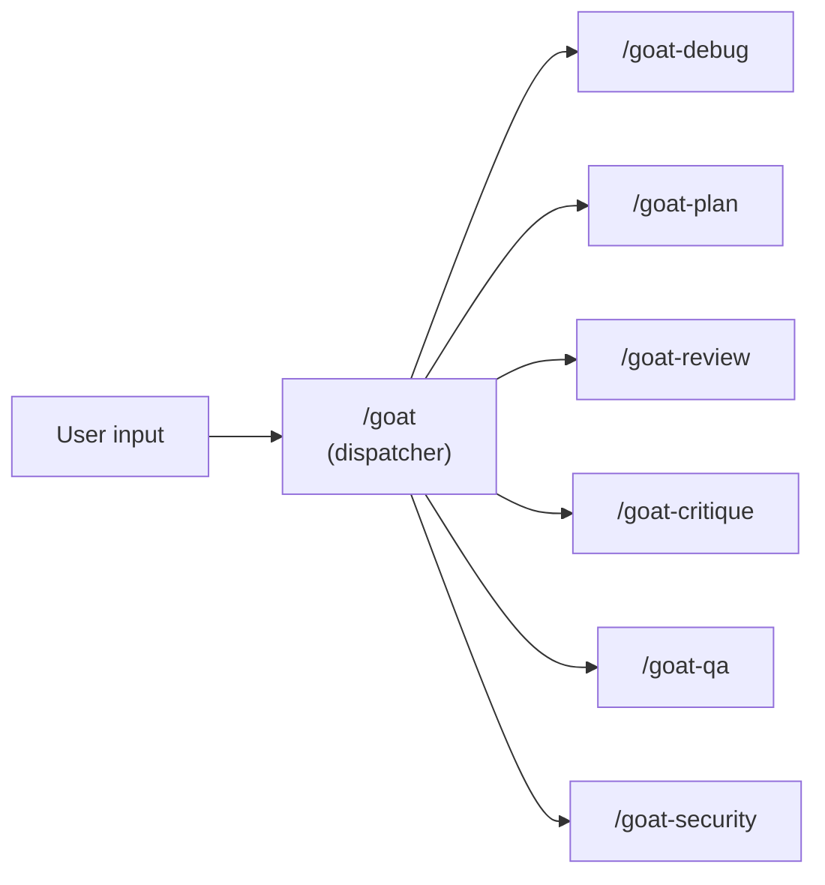
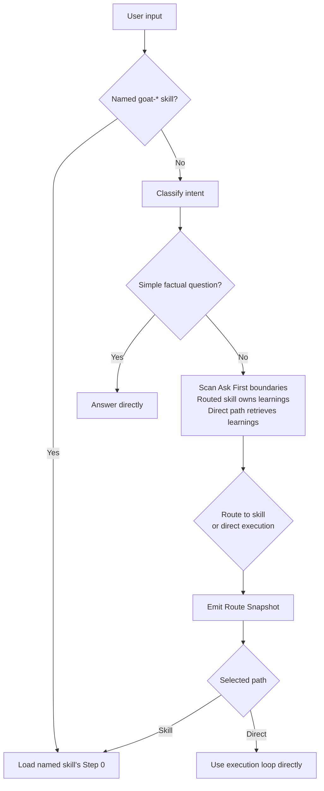
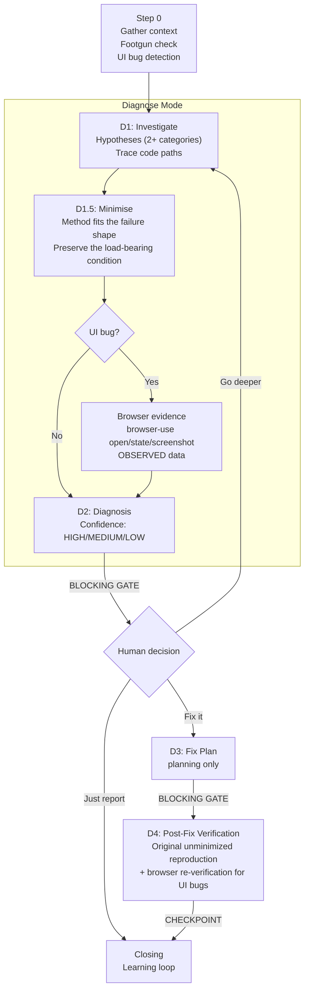
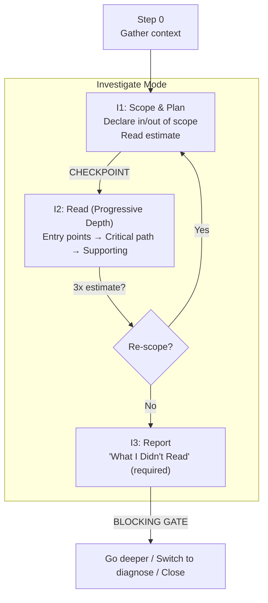
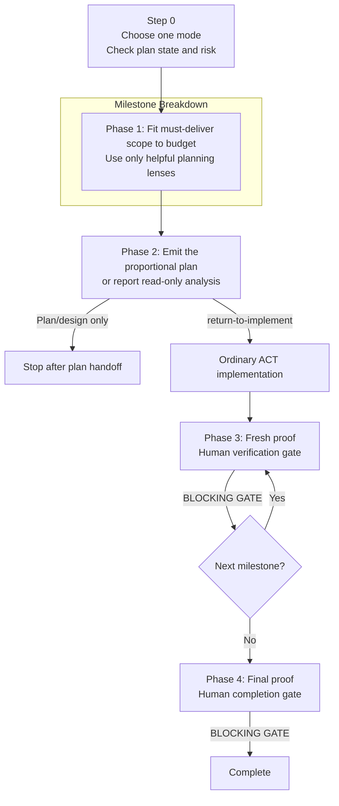
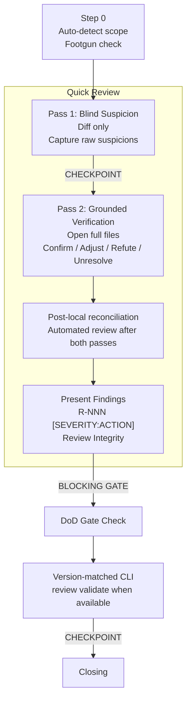
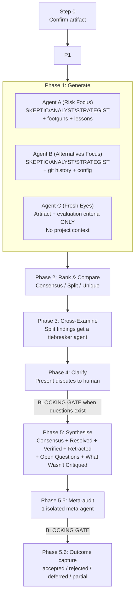
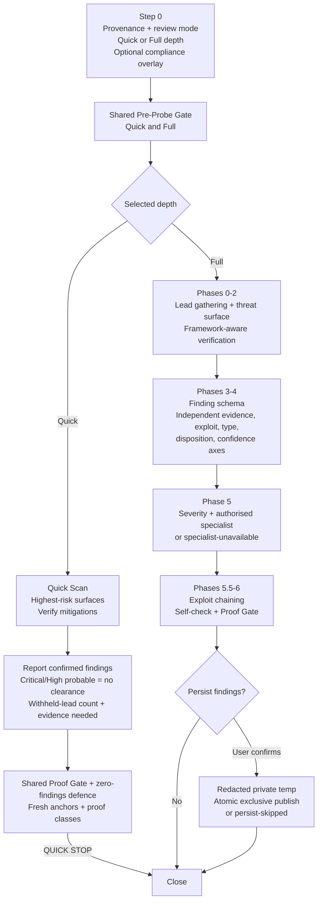
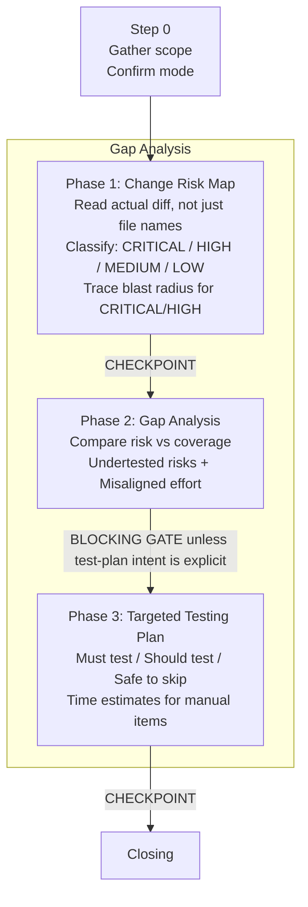

# Skills

Seven focused capabilities (six plus dispatcher) loaded on demand. Each skill has a distinct artifact, a hard quality gate, and a repeatable output. Skills don't load unless invoked - they stay out of the instruction budget.

All skills use the `goat-` prefix to avoid conflicts with built-in agent commands.

## Skill Quality Surfaces

The Skills page separates three quality verbs:

| Verb | Surface | What it does |
|------|---------|--------------|
| **Audit** | Installed skills and references | Deterministic structure score, classification confidence, metric breakdown, and recommendation. |
| **Evaluate** | Draft markdown | Deterministic score and improvement tips for pasted/uploaded content. Read-only. |
| **Assess** | Runner session | LLM semantic review launched from **Assess in Runner**. Advisory only. |

The semantic layer starts from the deterministic baseline and asks the runner to score Clarity, Examples, Focus, and Coherence on a 1-5 scale. The prompt includes anti-bias guidance, a final `ship` / `revise` / `block` gate, and a final fenced JSON verdict. The dashboard does not persist or render that JSON verdict yet; it remains runner output.

| Skill | Purpose | Hard Gate | When to Use |
|-------|---------|-----------|-------------|
| [/goat](#goat--dispatcher) | Route to the right skill | None | When intent is ambiguous; skip for simple implementations (the no-skill fast path in `skill-preamble.md`) |
| [/goat-debug](#goat-debug) | Diagnosis-first debugging + investigate mode + browser evidence | No fixes until human reviews diagnosis | Bug or test failure, UI issues, exploring unfamiliar code |
| [/goat-plan](#goat-plan) | Milestone planning with claim-based Proof | Human approval closes every milestone and the final plan | Before non-trivial implementation |
| [/goat-review](#goat-review) | Structured code review + quality audit | Negative verification before presenting findings | Before merging, quality audits |
| [/goat-critique](#goat-critique) | Multi-perspective critique of any artifact | Runs only with delegated sub-agents; blocks on unresolved disputes before synthesis | High-stakes decisions, plans, assessments |
| [/goat-security](#goat-security) | Threat-model-driven security assessment | MUST re-check framework/tooling mitigations before flagging findings | Before releases, after dependency changes, during audits |
| [/goat-qa](#goat-qa) | Testing gap analysis and verification planning | Does not run or write tests; generates gap analysis and testing plan | After a milestone or 30-60 min of coding |

---

## Choosing the Right Skill

| Situation | Skill | Why not the others |
|-----------|-------|--------------------|
| "Are there security issues?" | /goat-security | Threat-model-driven scan with framework verification |
| "This test is failing, why?" | /goat-debug | Need diagnosis before fixing |
| "How healthy is this module?" | /goat-review (audit mode) | Systematic scan, not a single bug |
| "How does this subsystem work?" | /goat-debug (investigate mode) | Understanding before changing |
| "I'm new to this project" | /goat-debug (investigate mode) | Progressive depth reading + orientation |
| "How should we build this feature?" | /goat-plan | Planning before implementing |
| "Are these changes safe to merge?" | /goat-review | Reviewing changes, not finding new issues |
| "How do we verify coverage for this work?" | /goat-qa | Risk-based testing gap analysis (planning, not execution) |
| "The UI is broken / rendering wrong" | /goat-debug | Browser evidence capture via browser-use CLI |
| "Is this bug fix verified?" | /goat-debug | Re-run the original repro and adjacent regressions |
| "Is this diff/PR verified?" | /goat-review | Two-pass review with Review Integrity |
| "Is this plan/assessment sound?" | /goat-critique | Multi-perspective critique before shipping |

---

## /goat - Dispatcher

Route to the right skill in one step. Type `/goat` followed by what you need.

Explicit skill invocations pass through immediately. Otherwise, the dispatcher classifies intent conversationally - not by keyword lookup. It answers simple factual questions directly; inferred skill and direct-execution routes emit a Route Snapshot. It asks 0-2 clarification questions max and routes with a stated assumption if still ambiguous.

| Intent | Skill |
|--------|-------|
| Bug, error, symptom, crash | /goat-debug (diagnose) |
| UI bug, rendering issue, browser-visible symptom | /goat-debug (diagnose + browser evidence) |
| Explore, understand, new to this | /goat-debug (investigate) |
| Review changes, PR, diff | /goat-review (quick review) |
| Quality sweep, audit | /goat-review (audit) |
| Security, vulnerability, compliance | /goat-security |
| Plan, design, build a feature | /goat-plan (via Planning Route) |
| Test gaps, coverage, verification planning | /goat-qa |
| Critique a plan/assessment | /goat-critique |

**Planning Route:** Hotfixes use direct execution. A plan/design verb routes to planning-only `/goat-plan`; a non-trivial build/change verb routes through `/goat-plan` with `return-to-implement`. After Phase 2, that handoff starts ordinary ACT implementation without repeating the build authorization; new Ask First boundaries still gate. Bare or ambiguous task paths remain read-only context. `/goat-plan` owns `.goat-flow/plans/.active` lookup, existing-plan discovery, complexity classification, and milestone-mode selection; analysis signals ("break this down for me", "how would you approach") select Read-Only Analysis.

**Task path classifier examples:**

| Input | Expected mode |
|-------|---------------|
| Bare task directory path | Read-only orientation; no writes |
| Task directory path plus `start current milestone` | Implementation may start after normal gates |
| `resume` plus a task directory path | Confirm current milestone unless the plan clearly records one |
| `update current milestone` plus a task directory path | Update the named milestone file only |
| `implement current milestone` plus a task directory path | Code implementation may proceed after reading gates |

---

## /goat-debug

Diagnosis-first debugging and codebase investigation.

| Mode | Trigger | What it does |
|------|---------|-------------|
| **Diagnose** | bug, error, crash, symptom | Hypothesis-driven debugging with confidence-gated fixes |
| **Diagnose (UI)** | UI bug, rendering issue, browser-visible symptom | Browser evidence capture via `browser-use` CLI, then hypothesis-driven debugging |
| **Investigate** | explore, understand, how does, new to this | Deep codebase reading with progressive depth and evidence tags |

**Diagnose mode:**

No fixes until human reviews diagnosis, and approval to write D3 authorizes planning only - implementation needs its own approval. Symptom reproduction is not root-cause proof: HIGH requires a traced mechanism plus a distinguishing counterfactual or intervention, MEDIUM means the mechanism is traced but distinguishing proof is unavailable or unsafe, and LOW rests on a load-bearing inferred link. For UI bugs, Step 0 detects browser-visible symptoms and loads `.goat-flow/skill-docs/playbooks/browser-use.md` on-demand. D1 uses browser evidence (screenshots, DOM state) to confirm or eliminate hypotheses after initial code reading. D4 reruns the browser reproduction post-fix as proof. Browser evidence is OBSERVED data; interpretations remain INFERRED until mapped to `file + semantic anchor`. When `browser-use` is unavailable, the reference includes a manual fallback using OS screenshot tools and browser DevTools.

**Investigate mode:**

For an explicit goal and scope continue without waiting at I1; pause only for ambiguity or before exceeding the declared read limit. For onboarding ("I'm new to this project"), use investigate mode - covers stack detection and codebase orientation through progressive depth reading.

---

## /goat-plan

Milestone planner and manager. The delivery budget controls scope: it fits the smallest complete result, estimates coding-agent time separately from human waiting, and adds detail only when risk or handoff needs it.

**Modes:** Path-Only Intake and Read-Only Analysis never write. Named-File Update changes only the named plan file. Small File-Write creates one compact file; Standard File-Write creates a one-screen `ISSUE.md` overview plus executable milestones. High-risk work adds only the assumptions, rollback, compatibility, security, or layered proof its named risks require.

**Planning lenses:** Prove It Works, Make It Real, Make It Solid, and Make It Shine are optional planning lenses, not required phases. A spike exists only for a named uncertainty. Lenses merge or disappear when they do not reduce uncertainty, deliver independent value, or create a real decision gate.

**Artifacts and proof:** Small plans target one screen. Standard overviews put outcome, budget, must-deliver scope, exclusions, risk, proof, and next action first. Milestones keep tasks executable for a fresh agent, organise proof as claim → evidence, give each command one home, and omit empty sections. Delivery bands in `ISSUE.md` are roll-ups of milestone forecasts, never inputs used to size those milestones.

**Agent-time forecasts:** Count positive agent-owned Task, Proof, Mid-proof, and admin entries; exclude `[HUMAN]` and zero-minute items. Below three matching receipt-backed bases, multiply the count by the `0.5-2.5-10 min/unit` cold-start prior and record the inputs in `Forecast basis:`. At three or more samples, use the low-median-high rates shown by `plans check`. A changed scope or `reforecast required` advisory blocks implementation until the basis, range, headline, and item estimates agree.

**Execution and recovery:** Authorized build/change requests may return to ordinary ACT without another implementation-approval pause. Every milestone still stops on invalidated assumptions, kill criteria, changed scope, or conflicting evidence. Fresh proof records actual effort before the blocking human gate. Reconciliation remains read-only, and plan state remains local workflow context.

**Completion:** Final closure requires current evidence and human approval. `/goat-plan` never infers approval, silently weakens requirements, auto-runs `/goat-critique`, or writes self-deletion instructions.

---

## /goat-review

Structured code review and quality audit with negative verification.

| Mode | Trigger | What it does |
|------|---------|-------------|
| **Quick Review** | review, PR, diff | Diff-only suspicion pass followed by grounded verification |
| **Audit** | audit, quality sweep | Systematic codebase area scan - findings only, no fixes |
| **Direction / Opportunity Audit** | explicit future-direction request | Advisory, repo-grounded opportunities kept separate from defect verdicts |

**Quick Review:**

Pass 1 never surfaces findings. Pass 2 is the source of truth: it opens full files and classifies each suspicion as confirmed, adjusted, refuted, or unresolved; refuted items stay in the local ledger rather than Findings. Automated-review conclusions stay unread until both local passes finish, then locally verified bot-only findings may enter the same evidence pipeline. MUST NOT flag pre-existing issues as part of this change.

Findings use `R-NNN [SEVERITY:ACTION]`, semantic anchors, Evidence/Proof, and `Harm:` for MUST/SHOULD; every result includes Review Integrity. With a version-matched CLI, pipe the draft through `goat-flow review validate`; validator unavailability does not block reporting.

Pass 2.5 re-frames only evidence already gathered and makes no new tool, file, command, or model calls. Refutation ledgers use a declared exact path and counted one-line records; ledgers and captured refuter JSON use host-owned pre-write redaction. Unavailable redaction skips persistence but preserves the count. Full and compact integrity output records `Review validator: validated | validator-unavailable`.

Pass 3 is optional and requires explicit informed approval. An uncited or unresolvable refuter claim cannot remove a finding; a MUST remains blocking until the host verifies its cited guard, and only a verified citation can change Ship Verdict.

**Audit mode:** For codebase areas (not a diff). Scan using severity ordering, run negative verification, group 3+ related findings as systemic patterns. MUST NOT propose fixes in audit mode - findings only.

**Direction / Opportunity Audit:** On explicit request, the area audit can also surface unfinished intent, stated-but-undelivered behavior, surface asymmetry, adjacent possibilities, and repeated friction. Every item needs a live repository anchor; opportunity ranking uses impact/effort adjusted for confidence and fix risk, while defects remain severity-ordered and continue to control Ship Verdict.

---

## /goat-critique

Multi-perspective critique for a concrete artifact (plan, security assessment, debug hypothesis set, review findings, architecture proposal). goat-critique runs in one mode: full delegated, with Phases 1-5 plus mandatory meta-audit (5.5) and outcome capture (5.6). Rationale: `.goat-flow/learning-loop/decisions/ADR-021-goat-critique-full-mode-only.md`.

| Delegation | Phases |
|------------|--------|
| 3 critique agents (always), up to 3 cross-exam agents (conditional), 1 meta-agent (always) | 1-5: Generate → Rank → Cross-Examine → Clarify → Synthesise; 5.5: Meta-audit; 5.6: Outcome capture |

**Key constraints:** MUST use real delegated sub-agent calls, not inline role-play. MUST run the meta-audit before the synthesis gate and capture outcomes only after the human responds. MUST restrict the fresh-eyes pass to artifact + evaluation criteria only (no project context). MUST include "What Wasn't Critiqued" section (never empty). MUST put low-confidence recommendation candidates under Open Questions until evidence supports them.

---

## /goat-security

Threat-model-driven security assessment with framework-aware verification. It records named, versioned baselines and explicitly skipped applicable categories. For CLI, tooling, and setup repos, it prioritises shell execution, hooks, filesystem access, PTY/session management, local HTTP/WebSocket surfaces, prompt generation, agentic boundaries, and dependency supply-chain risk.

| Mode | Trigger | What it does |
|------|---------|-------------|
| **Quick Scan** | quick scan, bounded diff/security check | Verify the highest-risk surfaces, report evidence, and stop before Full-only specialist work |
| **Full Assessment** | full assessment, release/security posture | Threat model, framework-aware verification, calibrated findings, specialist cross-check, and proof gate |
| **Compliance Mode** | HIPAA, GDPR, compliance | Overlay Quick or Full with source-bound control mapping without claiming certification |

**Quick and Full paths:**

Quick Scan stops after its five reporting steps, shared Proof Gate, and zero-findings defence, then recommends Full Assessment instead of entering specialist work. Every retained or withheld lead carries confidence, evidence status, exploit status, finding type, risk disposition, severity, proof-class, and evidence needed; a Critical/High probable lead is `NEEDS-DECISION`, never clearance. Any unassessed material critical surface or skipped posture-relevant applicable category makes the conclusion coverage-degraded and withholds clearance. The intake records every runtime class as `applicable`, `not applicable`, or `not assessed` with scope/deployment evidence; unresolved or inferred applicability is `not assessed`, `coverage-degraded`, and withholds clearance. Native, desktop, mobile, embedded, unsafe-FFI, GenAI/LLM/RAG, non-generative ML/model, agentic, and infrastructure classes need a named baseline or remain not assessed. LLM systems use the OWASP LLM Applications 2025 pack alongside Agentic 2026 when both apply. Non-generative ML needs a complementary authoritative baseline covering adversarial evasion, model extraction/inversion, membership inference, and poisoning. Binary, unscannable, or `-diff`-suppressed high-risk blobs remain coverage gaps until bounded raw-byte inspection succeeds. Git inspection disables replacement objects, pagers, fsmonitor, external diff, and text conversion, and does not checkout, run filters, or fetch referenced content without its own gate. Artifact findings record source, immutable digest, member/path, and byte identity; a digest identifies inspected bytes but does not establish trust or safety. Submodule OIDs likewise identify pointers, so Critical/High proof re-reads referenced content. Quick and Full share the pre-probe scanner gate. Scanner connectivity is exactly one of offline-only or networked; target effect is independently read-only or mutating. Operational report/cache output is not target mutation. Target-controlled execution is bound to the exact current tool invocation and requires isolated least-privilege containment without secrets, resource ceilings, and a stop mechanism; uncertain egress or mutation inherits those gates. Active probes and mutating scans require the full eight-part active-testing tuple. Quick output includes class applicability/evidence and a pre-probe record with tool/run, connectivity, target effect, target-controlled execution, active probing, destination, submitted data, credentials, and authorization or withheld state. Full output includes per-class disposition, scope/deployment evidence, baseline name/version, and currency evidence/status. Quick and Full output include a category ledger for every family: scanned, skipped, not applicable, or not assessed, with scope evidence. The category ledger has one row per family per selected baseline with baseline name/version, family, status, assessment evidence @ authority/snapshot, evidence status, proof-class, and scope evidence. `scanned` requires current-session `OBSERVED` evidence at exact authority/snapshot proving family coverage at affected scope/deployment; `not applicable` requires current `OBSERVED` applicability evidence at scope authority. Mismatched/unresolved bindings and `INFERRED`, `UNVERIFIED`, or `HUMAN-PENDING` rows are `not assessed`, coverage-degraded, and withhold clearance. Every `skipped` row follows that non-clearance posture. A selected-baseline family skipped or not assessed is coverage-degraded and withholds clearance. Infrastructure/IaC/cloud/container/orchestrator changes require a named provider/project baseline or remain not assessed. For untrusted diffs, independently verified repository/remote/ref/OID identifies the trusted base; local reviews distinguish `HEAD`, index, and worktree evidence. Every untrusted provenance needs independent policy authority: artifact/worktree policy alone cannot authorize accepted risk or clearance. Base-policy lookup distinguishes present, absent, and unreadable; head policy additions remain proposed until trusted adoption, while unavailable high-risk old/base evidence remains `PROBABLE`, `UNVERIFIED`, and `NEEDS-DECISION`. An open confirmed Critical/High finding blocks. A valid exception can change `OPEN` to `ACCEPTED-RISK`, recording an authorized governance decision without changing the technical rating or calling the risk safe or cleared; reports include its identifier, clause, independently trusted approval evidence, owner, named authorized approver, rationale, expiry, and verified scope match, and it cannot replace `NEEDS-DECISION`. Confidence, evidence status, exploit status, finding type, risk disposition, and severity are independent. Framework-mitigated defaults suppress a lead only with current `OBSERVED` evidence at declared authority proving the mitigation applies to the affected path; otherwise retain it with the missing check and non-clearance posture. Positive observations report claim, authority, affected scope/path, evidence status, and proof-class; only `OBSERVED` evidence that proves applicability to that scope/path may support clearance; `INFERRED`, `UNVERIFIED`, and `HUMAN-PENDING` observations cannot. A required specialist must be independently admissible and already authorised; otherwise the report records `specialist-unavailable` without blocking. Compliance overlays Quick or Full. Its authoritative applicable-control inventory must be independently verified complete, with one row per applicable control; omitted controls or an unverifiably complete inventory are `not assessed`, coverage-degraded, and MUST NOT recommend clearance. It also emits a row for every supplied control, including `not applicable`. Under untrusted provenance, persistence forbids the source-checkout redactor fallback and requires an independently trusted absolute installed binary or `persist-skipped`; write approval does not satisfy target-controlled execution authorization. Persistence binds write approval to the resolved destination and requires race-safe no-follow parent traversal beneath the approved root; otherwise it reports `persist-skipped`. It redacts to a fresh private temporary file and atomically publishes without overwrite. Pre-publication failure is `persist-skipped`; post-publication cleanup failure is `persisted-cleanup-pending`, not a false skip.

Reports include baseline currency evidence/status. Baseline identity and currency must come from an independently trusted authoritative source; target/head baseline or currency claims are evidence only. Missing, stale, or currency-unverified baselines—and authority-unverified baselines—remain not assessed and coverage-degraded, so they cannot support clearance. When application and API surfaces both apply, both baselines require separate currency evidence/status; omitting either leaves the affected surface not assessed and coverage-degraded. Every applicable infrastructure layer requires a separate named/versioned baseline and currency evidence/status; omitted layers remain not assessed and coverage-degraded. Runtime inventory ends with `other/unknown`, preventing unmatched classes from silently clearing. Quick retained/withheld leads include a file + semantic anchor, authority, entry→sink or requirement gap, remediation, and proof-of-fix. Before any Git read, use a trusted absolute Git binary in a clean, allowlisted environment, clear inherited `GIT_*` variables, then set `GIT_CONFIG_NOSYSTEM=1`, `GIT_CONFIG_GLOBAL=/dev/null`, `GIT_NO_LAZY_FETCH=1`, and `GIT_OPTIONAL_LOCKS=0`. Before invoking Git, use non-Git no-follow reads to resolve and validate any gitfile and `commondir`, including the resolved common directory. Validate repository config, includes, and alternates in resolved Git and common directories. Bind resolved Git directory/worktree to Git-dir/work-tree paths and set `GIT_COMMON_DIR` to the independently resolved trusted absolute common directory. Require an isolated read-only snapshot or equivalent descriptor-anchored identity stability excluding untrusted mutation throughout each Git invocation; otherwise do not invoke Git. Use only allowlisted non-executing plumbing with fixed allowlisted argv; never pass repo-controlled refs or options. Use literal pathspec mode and `--` before every untrusted path. Git stdin MUST NOT receive repo-controlled data; batching requires `-Z`, validated full-format OIDs, no untrusted revision/object expressions, bounded output/runtime, and explicit response-to-object identity verification. Every Git command emitting repo-controlled names/paths MUST use NUL-delimited output (`-z`/`-Z` as applicable), byte-safe schema parsing, and record-to-object verification. Signature verification or configured helpers are target-controlled execution and require an independently pinned helper under the Shared Pre-Probe Gate. Disable fsmonitor and hooks, and pin independently validated Git/work-tree paths; unvalidated binary, environment, paths, repository-local config, alternates, and missing objects stay `UNVERIFIED`. Worktree-sensitive Git diff/status requires attributes and filters independently neutralized; read worktree bytes through non-Git read-only primitives. Apply no-follow path classification before every worktree content read. Inspect symlinks as link text/object metadata only; any path that can escape the independently validated worktree is `UNVERIFIED` and is not read through its referent. Network approval binds the effective destination; DNS/redirects must stay in approved scope. Bind the approved resolved address to the actual connected peer before application data, repeat on every redirect/retry, and stop for re-authorization on mismatch. Accepted-risk evidence separates owner from a named authorized approver and requires independently trusted approval evidence plus the trusted policy source/ref/OID/anchor. Approval evidence must authenticate the named approver, prove their policy-authorized role at approval time, and bind the exception identifier, clause/decision, exact scope, and expiry; mismatch retains `OPEN`. Compliance rows retain jurisdiction and effective date. Every disposition except `not assessed` requires current `OBSERVED` evidence at applicable control authority, bound to exact assessed authority/snapshot and affected scope/deployment; `partially compliant` needs observed satisfied portions and observed gap; `non-compliant` needs observed gap. Mismatched or unresolved/inferred satisfaction/gap/applicability/snapshot/scope is `not assessed`, coverage-degraded; MUST NOT recommend clearance. Compliance rows include evidence authority/snapshot, affected scope/deployment, evidence status, and proof-class.

Regular worktree content requires a descriptor-anchored, race-safe no-follow open beneath the validated root, followed by post-open identity/type verification. When that proof is unavailable, the content remains `UNVERIFIED`.

| Repo type | Check these mitigations first |
|-----------|------------------------------|
| Web app / API | CSRF/auth middleware, ORM parameterization, rate limiting, escaping defaults |
| CLI / tooling repo | deny hooks, shell quoting, PTY/session limits, filesystem scope checks, local-server bind defaults |
| Docs / setup framework | read-only defaults, no-write planning paths, prompt wording drift, installer no-clobber behavior, cross-reference checks |

---

## /goat-qa

Testing gap analyser. Compares code changes against testing coverage to find undertested risks and misaligned test effort. Does not write test code - hands off to the coding agent.

| Mode | Trigger | What it does |
|------|---------|-------------|
| **Standard** | test gaps, verify coverage, what's risky | Risk-based gap analysis for recent changes |
| **Audit** | test audit, coverage | Audit existing test coverage for a codebase area |
| **Regression Guard** | after bug fix | Define invariants and assess coverage for a specific fix |

Standard presents Phase 2 and pauses by default. An explicit "what should I test" or "test plan" intent auto-releases the gate as a checkpoint and continues through Phase 3. Audit mode always waits after its A4 gap report.

---

## Shared Conventions

Every skill shares:

- **Step 0** - context gathering before any work begins
- **BLOCKING GATEs** - agent stops and waits for human decision
- **CHECKPOINTs** - agent reports status and continues unless interrupted
- **Learning retrieval** - search generated learning-loop indexes first, then open only relevant source entries
- **Learning loop** - write durable entries only after a VERIFY failure, course correction, or explicit request
- **Ceremony scaling** - hotfixes skip ceremony, system changes get full treatment

See `.goat-flow/skill-docs/skill-preamble.md` (installed) or `workflow/skills/reference/skill-preamble.md` (source template) for the canonical shared conventions.

## Where Skills Live

| Agent | Path |
|-------|------|
| Claude Code | `.claude/skills/goat-{name}/SKILL.md` |
| Codex | `.agents/skills/goat-{name}/SKILL.md` |
| Antigravity | `.agents/skills/goat-{name}/SKILL.md` (shared with Codex) |
| Copilot CLI | `.github/skills/goat-{name}/SKILL.md` |

Skills are created during step 03 of the GOAT Flow setup. The skill templates in `workflow/skills/` document the prompts used to create them. A skill may also ship a nested `references/` directory; install and parity checks treat those files as part of the skill surface.

> **Consolidation history (v0.8.0-v1.1.0):** Nine skills were consolidated into the current seven. See ADR-009 for the full rationale. goat-critique was extracted as a standalone critique skill in v1.1.0, then renamed from goat-sbao in v1.2.0 (ADR-019).
