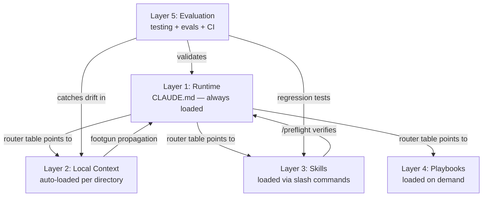

# The 5-Layer System

AI coding agents need structure, not just rules. This system organises everything an agent needs into five layers, each loading at a different time and serving a different purpose. Only Layer 1 loads every session. Everything else loads on demand.

```
┌─────────────────────────────────────────────────────────────┐
│  Layer 1 — Runtime                              ALWAYS ON   │
│  CLAUDE.md / AGENTS.md (~100-120 lines)                     │
│  Execution loop, autonomy tiers, DoD, router table          │
├─────────────────────────────────────────────────────────────┤
│  Layer 2 — Local Context                        AUTO-LOAD   │
│  Directory-level instruction files                          │
│  High-risk boundaries, module-specific gotchas              │
├─────────────────────────────────────────────────────────────┤
│  Layer 3 — Skills                               ON DEMAND   │
│  /preflight, /debug-investigate, /audit,                    │
│  /research, /code-review                                    │
├─────────────────────────────────────────────────────────────┤
│  Layer 4 — Playbooks                            ON DEMAND   │
│  Feature briefs, mob elaboration, SBAO ranking,             │
│  milestone planning                                         │
├─────────────────────────────────────────────────────────────┤
│  Layer 5 — Evaluation                           ON DEMAND   │
│  Agent eval suite, CI context validation,                   │
│  doer-verifier testing workflow                             │
└─────────────────────────────────────────────────────────────┘
```

---

## Layer 1 — Runtime

**What:** The root instruction file (`CLAUDE.md` for Claude Code, `AGENTS.md` for Codex). This is the agent's operating system — it loads every session, so every line must earn its place.

**Line budget:** ~100 lines for libraries/collections, ~120 lines for apps. Beyond 150 triggers an anti-pattern deduction. Evidence: auto-generated context beyond this range reduces agent success rates by ~3% and increases cost by 20%+ (HumanLayer, Philipp Schmid instruction limits research).

**What it contains:**

| Section | Purpose |
|---------|---------|
| **Execution loop** | READ → CLASSIFY → ACT → VERIFY → LOG. The 5-step behaviour loop that prevents fabrication, mode drift, early victory declarations, and silent failures. |
| **Autonomy tiers** | Always (safe, reversible) / Ask First (project-specific boundaries) / Never (destructive, irreversible). Each tier maps to an enforcement layer. |
| **Definition of Done** | 6 explicit gates. A task is not done until all gates pass. Includes the grep-after-rename gate and log-update gate. |
| **Router table** | Points to everything below — skills, local context files, docs, architecture. This is the highest-leverage section (tools mentioned here get 160x more usage — GitHub 2,500-repo analysis). |
| **Stack definition** | Build, test, lint, format commands. The agent's cheat sheet for the project's toolchain. |
| **Working memory** | Escalation ladder for long tasks: scratchpad → handoff file → ask human. |

**Enforcement:** Three layers protect the Runtime rules:
1. **Permissions deny list** (`.claude/settings.json`) — hardest enforcement, blocks commands before they run
2. **Hooks** (`.claude/hooks/`) — PreToolUse deny-dangerous, Stop lint, PostToolUse format
3. **Instruction file rules** — behavioural guidance the agent follows (softest layer, ~70% compliance)

**This folder:** `workflow/runtime/`

---

## Layer 2 — Local Context

**What:** Directory-level instruction files that auto-load when the agent works in that directory. A file at `src/auth/CLAUDE.md` loads every time the agent touches auth code.

**When to create:** When a module has 2+ footgun entries, is an Ask First boundary, or has conventions that differ from the project default. Do NOT create one for every directory.

**What it contains:** Module-specific footguns (1-2 lines each), local convention differences, cross-boundary warnings, hard constraints. Max ~20 lines per file.

**Relationship to footguns.md:** `docs/footguns.md` is the central index and source of truth. Footguns mapped to a specific directory are **propagated** (not moved) as one-line summaries into local instruction files.

**File locations:**

| Agent | Path |
|-------|------|
| Claude Code | `*/CLAUDE.md` (auto-loaded by directory) |
| Codex | `.github/instructions/*.md` (with `applyTo` frontmatter) |

**This folder:** `workflow/local-context/`

---

## Layer 3 — Skills

**What:** Focused capabilities loaded via slash commands. Each skill has a distinct artifact, a hard quality gate, and a repeatable output. Skills don't load unless invoked — they stay out of the instruction budget.

**The five skills:**

| Skill | Purpose | Output |
|-------|---------|--------|
| `/preflight` | Mechanical build verification (type-check, lint, compile, test) | Pass/fail checklist |
| `/debug-investigate` | Root cause analysis when a bug is reported or test fails | Diagnosis with evidence trail |
| `/audit` | Codebase quality review on demand or before major changes | Findings ranked by severity |
| `/research` | Deep investigation of unfamiliar areas or domains | Research summary with sources |
| `/code-review` | Structured review of changes before merging | Findings ranked by severity |

**Skill justification test:** A skill earns its place if it has at least one of: a distinct artifact, a hard workflow gate, a special failure mode, or a repeatable structured output. Skills that failed this test were downgraded to inline instructions.

**Naming:** Use `/code-review`, not `/review`. The name `/review` conflicts with built-in agent commands.

**File locations:**

| Agent | Path |
|-------|------|
| Claude Code | `.claude/skills/{name}/SKILL.md` |
| Codex | `docs/codex-playbooks/{name}.md` |

**This folder:** `workflow/skills/`

---

## Layer 4 — Playbooks

**What:** Planning tools loaded on demand when the developer needs to plan, scope, or break down work. These are not agent-runtime files — they're methodology templates the developer uses to structure thinking before giving the agent a task.

**Note:** Layer 4 is human-invoked methodology, not agent-loaded context. Unlike Layers 1-3 (which the agent reads and follows) and Layer 5 (which validates the agent's work), Layer 4 structures how humans plan before giving the agent a task. It lives in the framework because it's used alongside agent work and references the same architecture.

**The planning sequence:**

| Step | Playbook | What it produces |
|------|----------|-----------------|
| 1 | Feature Brief | Product definition: what, why, who, scope, risks, open questions |
| 2 | Mob Elaboration | Clarifying questions from multiple perspectives, with recommendations |
| 3 | SBAO Ranking | 3 competing plans ranked against criteria, synthesised into a prime plan |
| 4 | Milestone Planning | Phased implementation plan with tasks, exit criteria, assumptions, risks |

**When to use:** Before any non-trivial implementation. Run the sequence in order. Each step feeds the next.

**This folder:** `workflow/playbooks/`

---

## Layer 5 — Evaluation

**What:** Quality infrastructure that verifies the agent's work and catches drift over time. Includes the doer-verifier testing workflow, agent eval regression suites, CI context validation, and the learning loop (footguns, lessons).

**Components:**

| Component | Purpose | When it runs |
|-----------|---------|-------------|
| **Doer-verifier testing** | Three parallel verification tracks (automated tests, AI verification, human testing) after every milestone or 30-60 minutes of coding | After every coding session |
| **Agent evals** | Regression tests from real incidents — replay prompts that verify the agent handles known failure modes correctly | On demand, or after CLAUDE.md changes |
| **CI context validation** | Automated checks: instruction file line count, router reference resolution, skill completeness | On every PR |
| **Learning loop** | `docs/footguns.md` (cross-domain coupling with file:line evidence), `docs/lessons.md` (what worked/failed), `docs/confusion-log.md` (where the agent got confused) | Updated after every task |

**Create on first use:** Three artifacts materialise when first needed, not pre-created empty: `docs/confusion-log.md` (create after first real confusion incident), `.claude/profiles/` (create when meaningful role separation exists), and `docs/decisions/` (create when there's a real architectural decision worth recording). All other artifacts are created during initial setup.

**The doer-verifier principle:** The coding agent is the doer. Testing uses independent verifiers — automated suites, separate AI agents, and the developer. Never trust the coding agent's self-assessment.

**This folder:** `workflow/evaluation/`

---

## How the Layers Connect



Layer 1 is the hub. Its router table is the index to everything else. Layers 2-4 extend the agent's capabilities without bloating the always-loaded instruction budget. Layer 5 sits outside the agent's runtime and verifies the whole system is working correctly.

---

## Implementation Phases

| Phase | What it builds | Layers |
|-------|---------------|--------|
| Phase 0 (bootstrap) | Minimal CLAUDE.md + deny-dangerous hook + settings.json | Layer 1 (minimal) |
| Phase 1a | Full instruction file: execution loop, autonomy tiers, DoD, router, stack definition | Layer 1 |
| Phase 1b | Skills: /preflight, /debug-investigate, /audit, /research, /code-review | Layer 3 |
| Phase 1c | Enforcement: hooks, permissions deny list, preflight script, context validation | Layer 1 enforcement |
| Phase 2 | Agent eval suite, CI validation, permission profiles, RFC 2119 pass | Layer 5, enhances Layers 1-4 |

**Quarterly shrink:** Model-version gating required before removing rules. Run the eval suite on the current model version first. Shrink based on tooling improvements and rules never triggered in 90+ days.

**Layer 2** (local context) and **Layer 4** (playbooks) are created as needed, not in a specific phase. Local context files appear when a directory accumulates enough footguns. Playbooks are used whenever planning is needed.

### Graduation: Experiment → Maintained Project

Phase 0 (bootstrap) is the experiment tier — minimal setup for prototypes and weekend projects. The full system is the maintained project tier.

**Graduation triggers** (any one of these means it's time for the full system):
- First production user
- First team contributor beyond the original developer
- First real incident or regression
- First month of active development
- Structural complexity threshold (multiple modules, cross-boundary dependencies)

Until graduation, Phase 0 is sufficient. Don't over-invest in a prototype.

---

## Project Shape Adaptation

The system adapts to three project shapes. The layers stay the same — only the content and line budgets change.

| Aspect | App | Library | Script Collection |
|--------|-----|---------|-------------------|
| Layer 1 line target | ~120 | ~100 | ~100 |
| Layer 2 local files | Likely needed | Create where needed | Create where needed |
| Layer 3 skills | All 5 | All 5 | All 5 |
| Layer 5 evals | Real incidents | Stack failure modes | Real incidents |
| Layer 5 confusion-log | Yes | Yes | Yes |

---

## Folder Structure

This `workflow/` directory mirrors the 5-layer architecture:

```
workflow/
├── FIVE_LAYER_SYSTEM.md      ← You are here
├── getting-started.md        ← Entry point and reading order
├── runtime/                  ← Layer 1: setup prompts + project scaffolding
├── local-context/            ← Layer 2: domain instruction file prompts
├── skills/                   ← Layer 3: skill reference and justification
├── playbooks/                ← Layer 4: planning methodology prompts
├── evaluation/               ← Layer 5: testing workflow + footguns + evals
├── _reference/               ← System spec, design rationale, cross-agent comparison, examples
└── _draft/                   ← Archived raw source files
```
