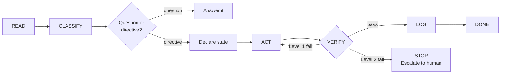

# The 5-Step Execution Loop

Every task the AI coding agent performs follows the same loop:

```
READ → CLASSIFY → ACT → VERIFY → LOG
```

This isn't a suggestion — it's the agent's operating procedure. Each step exists because a specific failure mode kept occurring without it. The loop lives in Layer 1 (the root instruction file) and loads every session.



---

## READ

**The problem it prevents:** Claude fabricates codebase facts. It guesses file contents, dependency versions, and API contracts without reading the actual files.

**The incident:** Asked about a dependency, Claude said it was a local path dependency. It was actually installed from a package registry. It never read the manifest.

**The rule:** Read the relevant files first. Never fabricate codebase facts.

| Project Shape | What to read |
|---------------|-------------|
| Apps | Both sides of cross-boundary changes (frontend + backend, API + consumer) |
| Libraries | Tests alongside implementation, data files alongside code |
| Script collections | Source chains — which shared files are sourced and how |

```
BAD:  "acme-client is a local path dependency" (fabricated without reading composer.json)
GOOD: Read composer.json first → "acme-client is installed via Packagist at ^1.3.0"
```

---

## CLASSIFY

**The problems it prevents:**
1. **Question/directive confusion** — "Did you also improve X?" gets treated as "improve X" when the user was just asking.
2. **Silent mode drift** — the agent slides from explaining into implementing without announcing the switch.

**The incident:** The question/directive confusion was exposed by the anti-rationalisation hook. A correct "No — want me to?" answer was rejected as "asking permission instead of implementing." The hook couldn't tell questions from directives either.

**The rule:** Classify the task on two axes before acting.

**Axis 1 — Complexity:**

| Level | Examples |
|-------|---------|
| Hotfix | One-line fix, typo, config tweak |
| Standard Feature | New endpoint, UI component, test suite |
| System Change | Architecture refactor, migration, new integration |
| Infrastructure Change | CI/CD, deployment, build system |

**Axis 2 — Mode:**

| Mode | What the agent does |
|------|-------------------|
| Plan | Produce an artifact (design doc, plan). No application code. |
| Implement | Write code. |
| Explain | Walkthrough only. No changes unless explicitly asked. |
| Debug | Diagnosis first. No fixes until human reviews. |
| Review | Independent investigation. Never blindly apply external suggestions. |

**Question vs directive:** If the message is a question, answer it. Do not infer an implementation action. If ambiguous: "Do you want me to explain this or fix it?"

**Mode transitions must be explicit.** No switching without announcing: "Switching to [NEW MODE] because [reason]."

**Anti-BDUF guard:** Don't over-engineer. Extract an interface when the second provider is needed, not before.

```
BAD:  User asked "explain the auth flow" → Claude edited auth_middleware.go
GOOD: User asked "explain the auth flow" → Claude wrote a clear walkthrough, no changes

BAD:  "Created INotificationProvider interface" (only one implementation exists)
GOOD: "EmailNotifier handles notifications. Extract interface when second provider needed."
```

---

## ACT

**The problem it prevents:** Planning loops and premature fixes. In Plan mode, Claude reads file after file without producing an artifact. In Debug mode, Claude starts fixing before understanding the bug.

**The calibration:** The "4th file read without writing = stop exploring, start coding" heuristic was calibrated from repeated planning loops where Claude read 8-12 files and produced nothing.

**The rule:** Each mode has explicit behaviour constraints.

| Mode | Behaviour | Exit condition |
|------|-----------|---------------|
| Plan | Produce artifact. No application code. | "LGTM" or "implement" from human |
| Implement | Write code within 2-3 turns. 4th file read without writing = stop exploring, start coding. | Task complete, tests pass |
| Explain | Walkthrough only. No code changes unless explicitly asked. | Explanation delivered |
| Debug | Diagnosis first with file:line evidence. No fixes until human reviews. | Human approves fix plan |
| Review | Investigate independently. Never blindly apply external suggestions. | Findings delivered |

**State declaration (required):**

```
State: [MODE] | Goal: [one line] | Exit: [condition]
```

No actions outside the declared state without announcing the switch and why.

---

## VERIFY

**The problem it prevents:** Claude declares victory early. Tests pass, but the old function name still appears in three files because nobody grepped after the rename.

**The incident:** A post-rename grep revealed stale references — the specific failure that led to Definition of Done gate #6 ("after bulk renames/refactors: grep for old pattern, zero remaining").

**The rule:** Run tests after each meaningful code change, not just at the end.

### Two-level escalation

```
Level 1 — Stop and Note (isolated failures):
  Flaky test, unrelated failure, non-blocking lint warning.
  → Note in Working Notes. Continue with caution.

Level 2 — Stop and Escalate (cross-boundary or security):
  Apps: auth, routing, deployment, API contracts, DB integrity.
  Libraries: public API changes, data file corruption, thresholds.
  Collections: shared source file breakage, cross-domain output contracts.
  → Full stop. Preserve error output. Write diagnosis with file:line. Wait for human.
```

This borrows from Toyota's "stop the line" principle — anyone on the line can halt production when they see a defect. Level 2 failures are the equivalent: the agent stops, preserves context, and escalates rather than attempting to fix a cross-boundary issue alone.

### Revert-and-rescope

When a fix isn't working:

1. **First attempt:** Escape and restate approach
2. **Second attempt:** `git revert` + rescope the task
3. **Third attempt:** `/clear` + handoff to human

**The two-correction rule:** Two corrections on the same issue = cut your losses. This applies to the _approach_, not legitimate multi-step work. If the agent has tried two different approaches to the same problem and both failed, it should stop and hand off rather than trying a third.

---

## LOG

**The problem it prevents:** The agent repeats the same mistakes across sessions. Without a learning loop, every conversation starts from zero.

**The evidence:** The same lesson was learned 3-4 times before being written down. The two-file split emerged because agent behaviour mistakes and architectural landmines serve different purposes and load at different times.

**The rule:** After each task, update the appropriate learning loop file.

| File | When to update | Example entry |
|------|---------------|---------------|
| `docs/lessons.md` | Behavioural mistake (agent did something wrong) | "Assumed API contract without reading frontend" |
| `docs/footguns.md` | Architectural landmine (cross-domain coupling) | "Auth nonce spans 4 components; breaking any one silently breaks login" |
| `docs/confusion-log.md` | Structural confusion (hard to navigate) | "Unclear which module owns session validation" |

**Footguns require evidence.** Every entry in `docs/footguns.md` must include file:line references to real code. Footguns without evidence are likely fabricated (anti-pattern AP4, -3 deduction).

**Loading rules:** `docs/footguns.md` is referenced from the router table and loaded on demand. Footguns mapped to specific directories are propagated as one-line summaries into Layer 2 local context files (e.g., `src/auth/CLAUDE.md`). The central file remains the source of truth.

---

## The Loop in Practice

A typical task flows like this:

```
1. READ    — Read the 3 files involved in the change.
             Discover that auth.ts imports from session.ts (not obvious from the task).

2. CLASSIFY — This is a Standard Feature in Implement mode.
              State: Implement | Goal: add rate limiting to login endpoint | Exit: tests pass

3. ACT     — Write the rate limiter. Hit a question about the session store.
              "Switching to Explain mode — I need to understand the session TTL before implementing."
              Read session.ts. Switch back to Implement.
              Write the code.

4. VERIFY  — Run tests. Login test passes. Session test fails (Level 2 — auth boundary).
              → Full stop. Preserve error. Diagnosis: rate limiter conflicts with session
              renewal window. Wait for human.

              Human: "good catch, the renewal window is 5 min, rate limit window should match"

              Fix applied. All tests pass. Grep for old function name — zero hits.

5. LOG     — docs/footguns.md: "Rate limit window must match session renewal window
              (auth.ts:47, session.ts:112). Mismatched windows cause silent auth failures."
```

---

## Definition of Done

The execution loop doesn't end when code is written. A task is done when all six gates pass:

1. Code compiles and passes linting
2. All existing tests pass (no regressions)
3. New tests cover the change
4. Preflight checks pass (`/preflight` or `preflight-checks.sh`)
5. Learning loop files updated (if applicable)
6. After bulk renames/refactors: grep for old pattern, zero remaining

Gates 5 and 6 are the ones most often skipped. They exist because of specific incidents where "tests pass" was not sufficient — stale references and unlogged footguns caused repeated failures in later sessions.

---

## Why Five Steps, Not Three or Seven

The loop started as READ → ACT → VERIFY (three steps). Two steps were added after real failures:

- **CLASSIFY was added** because the agent kept confusing questions with directives and drifting between modes silently. Without an explicit classification step, mode drift happened on ~30% of tasks.
- **LOG was added** because the same mistakes kept recurring across sessions. A 14-footgun discovery on a Tauri app was lost between sessions twice before the logging step was formalised.

No step has been added since v1.2 of the plan. The loop is stable.
